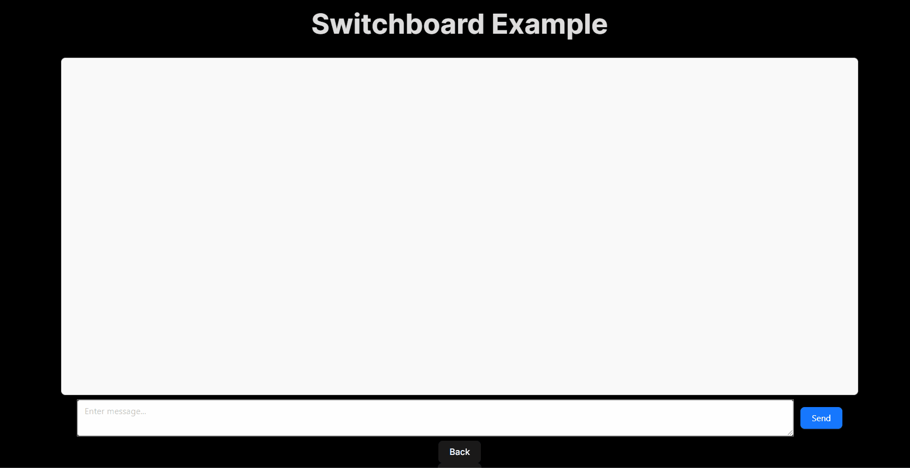
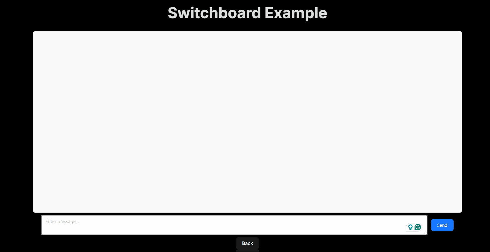
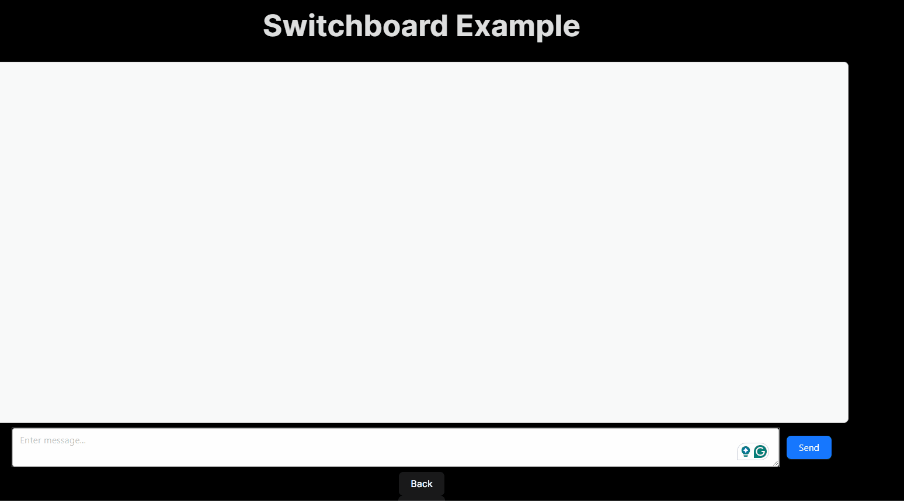
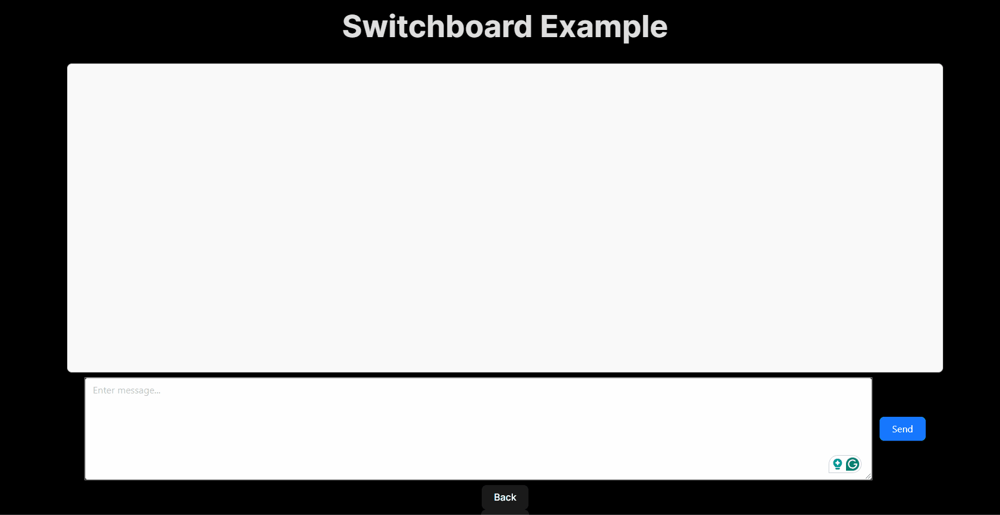
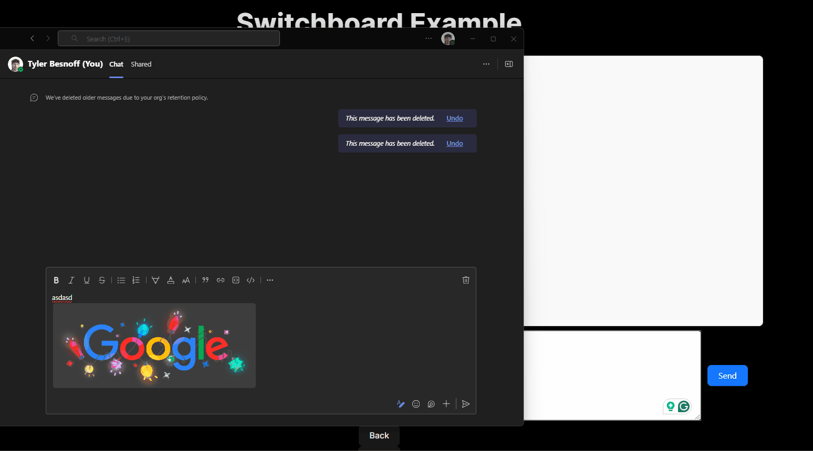

# Switchboard Copy Paste Image Example
Created by Tyler Besnoff for Copy Paste Image SPIKE #1144829 to display a way to access the clipboard and paste images
Details how we can use the Clipboard API to access the clipboard and paste images into the browser

Check the useReadClipboard for details on how the clipboard is used including revoking temporary image urls that are created
Check the switchboardContextProvider for details on how the images can be sent as a formData and passed into sendPhotoAsCustomer

## GIFs of scenarios (side note I have no idea why the colors look off)

### Scenario 1: Copying an image from a website and pasting it into the browser

### Scenario 2: Copying multiple images from a website and pasting them into the browser

### Scenario 3: Copying an image from a website and pasting it into the browser with text

### Scenario 4: Copying an image from a website and pasting it into the browser with text when fetched (this may have security issues because we are fetching random urls)

### Scenario 5: Copying an image from a website including text that cannot be turned into a blob 

### Scenario 6: Copying image and then text with image where image is valid until text is copied
